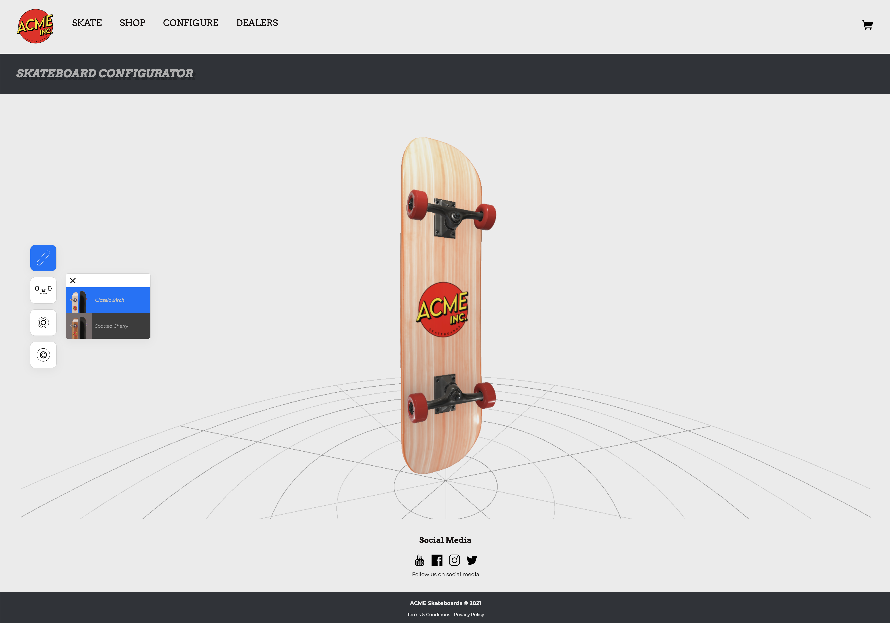

# ProductVisualization - 3Dint Second Project

### Author:
- Marzona Eugenio - 128623
- Demo: [github.io](https://gemini64.github.io/ProductVisualization/)

## A brief description
This mockup website includes a simple webGL skateboard configurator.

Using a minimal overlay-ui the user can change the appearance of the skateboard's board, trucks, wheels and harware by choosing between a few available option.

## Included files
This repository includes:
* `./index.html` -> HTML entrypoint. Contains some markup for the mockup website.
* `./main.js` -> Main js module. Creates the WebGL canvas, loades the scene and the overlay-ui, and binds event listeners on domElements.
* `./res/main.css` -> The main (and only) stylesheet.
* `./res/models/*` -> Contains the skateboard's 3d model in GLTF format and another 3d model used for testing purposes (this was practically used as a shader-ball).
* `./res/icons/*` -> Vector and raster icons.
* `./res/fonts/*` -> Self-hosted typefaces. They are CC0 or open-license and were fetched from Google Fonts and DaFonts.
* `./res/images/*` -> This directory contains the environment maps and the products's thumbnails. The envMaps come from **HDRI Haven** and the scene's default environment map is **london_studio**.
* `./res/textures/*` -> This directory contains every texture in png format, in 2k resolution.
* `./three/*` -> Self-hosted **Three.js** library.
* `./modules/*` -> Ancillary js modules. These includes some data and html fragments templates and the shaders's source code.
* `./journal.md` -> A text document that describes, in broad terms, the creation process.

## Assets, usage licenses ecc...

### The skateboard 3D model
Skateboard [Sketchfab Texturing Challenge](https://skfb.ly/6WNV6) by Johnson Martin is licensed under [Creative Commons Attribution](http://creativecommons.org/licenses/by/4.0/).

### The statue used as shader-ball
Sculpture [Bust of Róża Loewenfeld](https://sketchfab.com/3d-models/sculpture-bust-of-roza-loewenfeld-fc6e731a0131471ba8e45511c7ea9996) by Malopolska`s Virtual Museums is is licensed under [CC0-1.0](http://creativecommons.org/publicdomain/zero/1.0/).

### Everything else
Other textures, images, and icons were produced by me.
If substance blender and other workfiles are needed, plese ask.

## Tools used 
- **VS Code** and **Firefox + Babylonjs extension**: for general Javascript/GLSL development.
- **Blender**: used to prepare the 3d model for texture panting. **Cycles renderer** was used to render the products's "thumbnails".
- **Substance Painter**: used to produce pbr-ready textures.
- **Affinity Designer** and **Affinity Photo**: used to produce icons and raster 2D assetes.
- **PowerVR's PVRTextTool**: used to produce pre-filtered ( BRDF convolved ) radiance/irradiance cube-maps.

## Known issues
This web-application should be ready for website deployment and should display as expected on modern versions (Javascript ES6 compliant) of **Firefox**, **Chrome/Derivates** and **Safari**.

Open issues:
- <s>The materials selector overlay is completely borked on Safari Desktop. This is probably due to a bug with Safari's css-flex property support.</s> (Fixed)
- <s>The interface should be mobile ready, however the application might fail to load on certain combinations of mobile OSs/browsers due to lack of **s3tc** codec support (the cubemaps used are encoded in s3tc format).</s> (Partially solved)
- The interface has no "lock camera" button.
- The user might experience minor z-fighting artifacts at certain distances from the scene's objects (this happens only on chome and safari).
